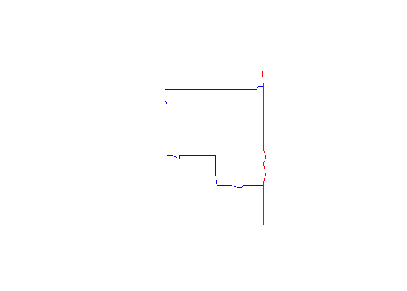

# azuremapsr

<!-- badges: start -->

[](https://cran.r-project.org/package=azuremapsr)
[](https://lifecycle.r-lib.org/articles/stages.html#stable)
[](https://www.gnu.org/licenses/gpl-3.0)

<!-- badges: end -->

The goal of `azuremapsr` is to provide an R interface to the Microsoft
Azure Maps REST APIs. This package simplifies the process of
authenticating, building requests, and parsing responses for various
geospatial services, starting with route directions.

## Installation

You can install the latest stable version of `azuremapsr` from CRAN
with:

``` r
install.packages("azuremapsr")   
```

You can also install the development version of `azuremapsr` from
[GitHub](https://github.com/) with:

``` r
# install.packages("pak")
pak::pak("juanfonsecaLS1/azuremapsr")
```

## Authentication

Before using the package, you need a subscription key from the Azure
Maps service. You can find instructions on how to obtain one
[here](https://learn.microsoft.com/en-us/azure/azure-maps/quick-demo-map-app#get-the-subscription-key-for-your-account).

Once you have your key, you can set it for your R session using the
`set_azuremaps_token()` function:

``` r
library(azuremapsr)
set_azuremaps_token("YOUR_API_KEY_HERE")
```

For a more permanent solution, you can store the key as an environment
variable named `azure_maps` in your `.Renviron` file. You can open this
file for editing by running `usethis::edit_r_environ()` and adding the
line `azure_maps='YOUR_API_KEY_HERE'`.

## Example

This example shows how to get the fastest driving route between two
points including a waypoint.

``` r
library(azuremapsr)
library(sf)

# This example will not run unless an API key is set.
# Replace "YOUR_API_KEY_HERE" with your actual key.
# set_azuremaps_token("YOUR_API_KEY_HERE")

# Define origin, destination, and waypoint
origin <- c(-122.3321, 47.6062)  # Seattle
destination <- c(-122.0369, 47.6609) # Redmond
waypoints <- c(-122.20687, 47.612002) # Bellevue

# Define route parameters
params <- list(
  optimizeRoute = "fastestWithTraffic",
  routeOutputOptions = "routePath",
  travelMode = "driving"
)

# Get the route (requires a valid API key to be set!!!)

sample_response <-   req_route_directions(origin, destination, waypoints, params)
```

Routes can be extracted from the response with the `get_routes` function

``` r
sf_routes <- get_routes(sample_response)

plot(sf_routes$geometry,col = c("blue","red"))
```



These are some of the attributes returned by the service:

``` r
sf_routes |> names()
```

    [1] "trafficCongestion"        "distanceInMeters"        
    [3] "durationInSeconds"        "arrivalAt"               
    [5] "departureAt"              "durationTrafficInSeconds"
    [7] "type"                     "legs"                    
    [9] "geometry"                
